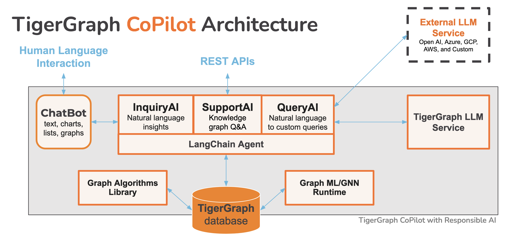
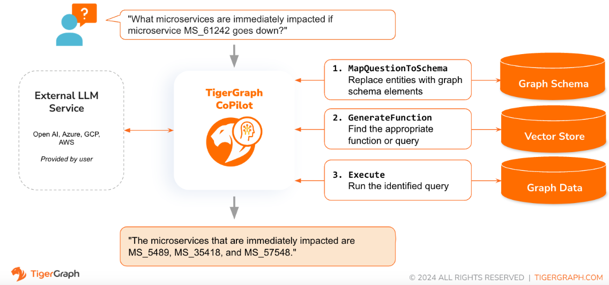
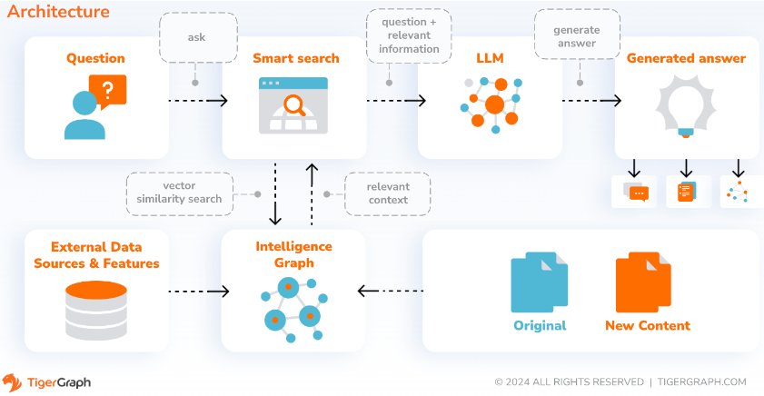

# TigerGraph CoPilot

## Releases
* **8/21/2024: CoPilot is available now in v0.9** (v0.9.0). Please see [Release Notes](https://docs.tigergraph.com/tg-copilot/current/release-notes/#_new_in_copilot_0_9) for details. Note: On [TigerGraph Cloud](https://beta.tgcloud.io/) only CoPilot v0.5 is available. 

* **4/30/2024: CoPilot is available now in Beta** (v0.5.0). A whole new function is added to CoPilot: Now you can create chatbots with graph-augmented AI on a your own documents. CoPilot builds a knowledge graph from source material and applies knowledge graph RAG (Retrieval Augmented Generation) to improve the contextual relevance and accuracy of answers to their natural-language questions. We would love to hear your feedback to keep improving it so that it could bring more value to you. It would be helpful if you could fill out this [short survey](https://forms.gle/c9jd4evjEPsVtR5p7) after you have played with CoPilot. Thank you for your interest and support!

* **3/18/2024: CoPilot is available now in Alpha** (v0.0.1). It uses a Large Language Model (LLM) to convert your question into a function call, which is then executed on the graph in TigerGraph. We would love to hear your feedback to keep improving it so that it could bring more value to you. If you are trying it out, it would be helpful if you could fill out this [sign up form](https://info.tigergraph.com/copilotalpha) so we can keep track of it (no spam, promised). And if you would just like to provide the feedback, please feel free to fill out this [short survey](https://forms.gle/c9jd4evjEPsVtR5p7). Thank you for your interest and support!

## Overview



TigerGraph CoPilot is an AI assistant that is meticulously designed to combine the powers of graph databases and generative AI to draw the most value from data and to enhance productivity across various business functions, including analytics, development, and administration tasks. It is one AI assistant with three core component services:
* InquiryAI as a natural language assistant for graph-powered solutions
* SupportAI as a knowledge Q&A assistant for documents and graphs
* QueryAI as a GSQL code generator including query and schema generation, data mapping, and more (Not available in Beta; coming soon)

You can interact with CoPilot through a chat interface on TigerGraph Cloud, a built-in chat interface and APIs. For now, your own LLM services (from OpenAI, Azure, GCP, AWS Bedrock, Ollama, Hugging Face and Groq.) are required to use CoPilot, but in future releases you can use TigerGraph’s LLMs.

### InquiryAI


When a question is posed in natural language, CoPilot (InquiryAI) employs a novel three-phase interaction with both the TigerGraph database and a LLM of the user's choice, to obtain accurate and relevant responses.

The first phase aligns the question with the particular data available in the database. CoPilot uses the LLM to compare the question with the graph’s schema and replace entities in the question by graph elements. For example, if there is a vertex type of `BareMetalNode` and the user asks `How many servers are there?`, the question will be translated to `How many BareMetalNode vertices are there?`. In the second phase, CoPilot uses the LLM to compare the transformed question with a set of curated database queries and functions in order to select the best match. In the third phase, CoPilot executes the identified query and returns the result in natural language along with the reasoning behind the actions. 

Using pre-approved queries provides multiple benefits. First and foremost, it reduces the likelihood of hallucinations, because the meaning and behavior of each query has been validated.  Second, the system has the potential of predicting the execution resources needed to answer the question. 

### SupportAI


With SupportAI, CoPilot creates chatbots with graph-augmented AI on a user's own documents or text data. It builds a knowledge graph from source material and applies its unique variant of knowledge graph-based RAG (Retrieval Augmented Generation) to improve the contextual relevance and accuracy of answers to natural-language questions.

CoPilot will also identify concepts and build an ontology, to add semantics and reasoning to the knowledge graph, or users can provide their own concept ontology. Then, with this comprehensive knowledge graph, CoPilot performs hybrid retrievals, combining traditional vector search and graph traversals, to collect more relevant information and richer context to answer users’ knowledge questions.

Organizing the data as a knowledge graph allows a chatbot to access accurate, fact-based information quickly and efficiently, thereby reducing the reliance on generating responses from patterns learned during training, which can sometimes be incorrect or out of date.


### QueryAI
QueryAI is the third component of TigerGraph CoPilot. It is designed to be used as a developer tool to help generate graph queries in GSQL from an English language description. It can also be used to generate schema, data mapping, and even dashboards. This will enable developers to write GSQL queries more quickly and accurately, and will be especially useful for those who are new to GSQL. Currently, experimental openCypher generation is available.

## Getting Started

### TigerGraph Cloud
CoPilot is available as an add-on service to your workspace on TigerGraph Cloud. It is disabled by default. Please contact beta-support@tigergraph.com to enable TigerGraph CoPilot as an option in the [Marketplace](https://docs.tigergraph.com/cloudBeta/current/integrations/).

### Self-Managed
TigerGraph CoPilot is an open-source project on [GitHub](https://github.com/tigergraph/CoPilot) which can be deployed to your own infrastructure.

If you don’t need to extend the source code of CoPilot, the quickest way is to deploy its docker image with the docker compose file in the repo. In order to take this route, you will need the following prerequisites.

#### Prerequisites
* Docker
* TigerGraph DB 3.9+. (For 3.x, you will need to install a few user defined functions (UDFs). Please see Step 5 below for details.)
* API key of your LLM provider. (An LLM provider refers to a company or organization that offers Large Language Models (LLMs) as a service. The API key verifies the identity of the requester, ensuring that the request is coming from a registered and authorized user or application.) Currently, CoPilot supports the following LLM providers: OpenAI, Azure OpenAI, GCP, AWS Bedrock.

#### Deploy with Docker Compose
* Step 1: Get docker-compose file 
  - Download the [docker-compose.yml](https://github.com/tigergraph/copilot/blob/main/docker-compose.yml) file directly , or
  - Clone the repo `git clone https://github.com/tigergraph/CoPilot`

  The Docker Compose file contains all dependencies for CoPilot including a Milvus database. If you do not need a particular service, you make edit the Compose file to remove it or set its scale to 0 when running the Compose file (details later). Moreover, CoPilot comes with a Swagger API documentation page when it is deployed. If you wish to disable it, you can set the `PRODUCTION` environment variable to true for the CoPilot service in the Compose file.

* Step 2: Set up configurations
  
  Next, in the same directory as the Docker Compose file is in, create and fill in the following configuration files:
  * [configs/db_config.json](#llm-provider-configuration)
  * [configs/llm_config.json](#llm-provider-configuration)
  * [configs/milvus_config.json](#embed-store-configuration)
  * [configs/chat_config.json](#chat-configuration)


* Step 3 (Optional): Configure Logging
  
  `touch configs/log_config.json`. Details for the configuration is available [here](https://docs.tigergraph.com/tg-copilot/current/getstarted/self-managed#_3_optional_logging).

* Step 4: Start all services

> NOTE: when TigerGraph is used as the embedding store, please comment out `etcd`, `minio`, `milvus-standalone` and related volumes. Or set Milvus DB's scale to 0 to not start it: `docker compose up -d --scale milvus-standalone=0 --scale etcd=0 --scale minio=0`.
>       Also uncomment `tigergraph` section from `docker-compose.yaml`. Please follow the [instructions](https://github.com/tigergraph/ecosys/blob/master/tutorials/GSQL.md#set-up-environment) to download TigerGraph docker image.

  Now, simply run `docker compose up -d` and wait for all the services to start.

* Step 5: Install UDFs

  This step is not needed for TigerGraph databases version 4.x. For TigerGraph 3.x, we need to install a few user defined functions (UDFs) for CoPilot to work.

  1. On the machine that hosts the TigerGraph database, switch to the user of TigerGraph: `sudo su - tigergraph`. If TigerGraph is running on a cluster, you can do this on any one of the machines.
  2. Download the two files [ExprFunctions.hpp](https://raw.githubusercontent.com/tigergraph/CoPilot/dev/copilot/udfs/milvus/rest/ExprFunctions.hpp) and [ExprUtil.hpp](https://raw.githubusercontent.com/tigergraph/CoPilot/dev/copilot/udfs/milvus/rest/ExprUtil.hpp).
  3. In a terminal, run the following command to enable UDF installation:
  ```
  gadmin config set GSQL.UDF.EnablePutTgExpr true
  gadmin config set GSQL.UDF.Policy.Enable false
  gadmin config apply -y
  gadmin restart GSQL -y
  ```
  4. Enter a GSQL shell, and run the following command to install the UDF files.
  ```
  PUT tg_ExprFunctions FROM "./tg_ExprFunctions.hpp"
  PUT tg_ExprUtil FROM "./tg_ExprUtil.hpp"
  ```
  5. Quit the GSQL shell, and run the following command in the terminal to disable UDF installation for security purpose.
  ```
  gadmin config set GSQL.UDF.EnablePutTgExpr false
  gadmin config set GSQL.UDF.Policy.Enable true
  gadmin config apply -y
  gadmin restart GSQL -y
  ```

#### Configurations

##### LLM provider configuration
In the `configs/llm_config.json` file, copy JSON config template from below for your LLM provider, and fill out the appropriate fields. Only one provider is needed.

* OpenAI
  
  In addition to the `OPENAI_API_KEY`, `llm_model` and `model_name` can be edited to match your specific configuration details.

    ```json
    {
        "model_name": "GPT-4",
        "embedding_service": {
            "embedding_model_service": "openai",
            "authentication_configuration": {
                "OPENAI_API_KEY": "YOUR_OPENAI_API_KEY_HERE"
            }
        },
        "completion_service": {
            "llm_service": "openai",
            "llm_model": "gpt-4-0613",
            "authentication_configuration": {
                "OPENAI_API_KEY": "YOUR_OPENAI_API_KEY_HERE"
            },
            "model_kwargs": {
                "temperature": 0
            },
            "prompt_path": "./app/prompts/openai_gpt4/"
        }
    }
    ```
* GCP

    Follow the GCP authentication information found here: https://cloud.google.com/docs/authentication/application-default-credentials#GAC and create a Service Account with VertexAI credentials. Then add the following to the docker run command:

    ```sh
    -v $(pwd)/configs/SERVICE_ACCOUNT_CREDS.json:/SERVICE_ACCOUNT_CREDS.json -e GOOGLE_APPLICATION_CREDENTIALS=/SERVICE_ACCOUNT_CREDS.json
    ```

    And your JSON config should follow as:

    ```json
    {
        "model_name": "GCP-text-bison",
        "embedding_service": {
            "embedding_model_service": "vertexai",
            "authentication_configuration": {}
        },
        "completion_service": {
            "llm_service": "vertexai",
            "llm_model": "text-bison",
            "model_kwargs": {
                "temperature": 0
            },
            "prompt_path": "./app/prompts/gcp_vertexai_palm/"
        }
    }
    ```

* Azure

    In addition to the `AZURE_OPENAI_ENDPOINT`, `AZURE_OPENAI_API_KEY`, and `azure_deployment`, `llm_model` and `model_name` can be edited to match your specific configuration details.
    ```json
    {
        "model_name": "GPT35Turbo",
        "embedding_service": {
            "embedding_model_service": "azure",
            "azure_deployment":"YOUR_EMBEDDING_DEPLOYMENT_HERE",
            "authentication_configuration": {
                "OPENAI_API_TYPE": "azure",
                "OPENAI_API_VERSION": "2022-12-01",
                "AZURE_OPENAI_ENDPOINT": "YOUR_AZURE_ENDPOINT_HERE",
                "AZURE_OPENAI_API_KEY": "YOUR_AZURE_API_KEY_HERE"
            }
        },
        "completion_service": {
            "llm_service": "azure",
            "azure_deployment": "YOUR_COMPLETION_DEPLOYMENT_HERE",
            "openai_api_version": "2023-07-01-preview",
            "llm_model": "gpt-35-turbo-instruct",
            "authentication_configuration": {
                "OPENAI_API_TYPE": "azure",
                "AZURE_OPENAI_ENDPOINT": "YOUR_AZURE_ENDPOINT_HERE",
                "AZURE_OPENAI_API_KEY": "YOUR_AZURE_API_KEY_HERE"
            },
            "model_kwargs": {
                "temperature": 0
            },
            "prompt_path": "./app/prompts/azure_open_ai_gpt35_turbo_instruct/"
        }
    }
    ```

* AWS Bedrock
  ```json
  {
      "model_name": "Claude-3-haiku",
      "embedding_service": {
          "embedding_model_service": "bedrock",
          "embedding_model":"amazon.titan-embed-text-v1",
          "authentication_configuration": {
              "AWS_ACCESS_KEY_ID": "ACCESS_KEY",
              "AWS_SECRET_ACCESS_KEY": "SECRET"
          }
      },
      "completion_service": {
          "llm_service": "bedrock",
          "llm_model": "anthropic.claude-3-haiku-20240307-v1:0",
          "authentication_configuration": {
              "AWS_ACCESS_KEY_ID": "ACCESS_KEY",
              "AWS_SECRET_ACCESS_KEY": "SECRET"
          },
          "model_kwargs": {
              "temperature": 0,
          },
          "prompt_path": "./app/prompts/aws_bedrock_claude3haiku/"
      }
  }
  ```

* Ollama
  ```json
  {
    "model_name": "GPT-4",
    "embedding_service": {
        "embedding_model_service": "openai",
        "authentication_configuration": {
            "OPENAI_API_KEY": ""
        }
    },
    "completion_service": {
        "llm_service": "ollama",
        "llm_model": "calebfahlgren/natural-functions",
        "model_kwargs": {
            "temperature": 0.0000001
        },
        "prompt_path": "./app/prompts/openai_gpt4/"
    }
  }
  ```

* Hugging Face

  Example configuration for a model on Hugging Face with a dedicated endpoint is shown below. Please specify your configuration details:
  ```json
  {
    "model_name": "llama3-8b",
    "embedding_service": {
        "embedding_model_service": "openai",
        "authentication_configuration": {
            "OPENAI_API_KEY": ""
        }
    },
    "completion_service": {
        "llm_service": "huggingface",
        "llm_model": "hermes-2-pro-llama-3-8b-lpt",
        "endpoint_url": "https:endpoints.huggingface.cloud",
        "authentication_configuration": {
            "HUGGINGFACEHUB_API_TOKEN": ""
        },
        "model_kwargs": {
            "temperature": 0.1
        },
        "prompt_path": "./app/prompts/openai_gpt4/"
    }
  }
  ```

  Example configuration for a model on Hugging Face with a serverless endpoint is shown below. Please specify your configuration details:
  ```json
  {
    "model_name": "Llama3-70b",
    "embedding_service": {
        "embedding_model_service": "openai",
        "authentication_configuration": {
            "OPENAI_API_KEY": ""
        }
    },
    "completion_service": {
        "llm_service": "huggingface",
        "llm_model": "meta-llama/Meta-Llama-3-70B-Instruct",
        "authentication_configuration": {
            "HUGGINGFACEHUB_API_TOKEN": ""
        },
        "model_kwargs": {
            "temperature": 0.1
        },
        "prompt_path": "./app/prompts/llama_70b/"
    }
  }
  ```

* Groq
  ```json
  {
    "model_name": "mixtral-8x7b-32768",
    "embedding_service": {
        "embedding_model_service": "openai",
        "authentication_configuration": {
            "OPENAI_API_KEY": ""
        }
    },
    "completion_service": {
        "llm_service": "groq",
        "llm_model": "mixtral-8x7b-32768",
        "authentication_configuration": {
            "GROQ_API_KEY": ""
        },
        "model_kwargs": {
            "temperature": 0.1
        },
        "prompt_path": "./app/prompts/openai_gpt4/"
    }
  }
  ```

##### DB configuration
Copy the below into `configs/db_config.json` and edit the `hostname` and `getToken` fields to match your database's configuration. If token authentication is enabled in TigerGraph, set `getToken` to `true`. Set the timeout, memory threshold, and thread limit parameters as desired to control how much of the database's resources are consumed when answering a question.

`embedding_store` selects the vector db to use, currently supports `tigergraph` and `milvus`. Set `reuse_embedding` to `true` will skip re-generating the embedding if it already exists.

`ecc` and `chat_history_api` are the addresses of internal components of CoPilot.If you use the Docker Compose file as is, you don’t need to change them. 

```json
{
    "hostname": "http://tigergraph",
    "restppPort": "9000", 
    "gsPort": "14240",
    "getToken": false,
    "default_timeout": 300,
    "default_mem_threshold": 5000,
    "default_thread_limit": 8,
    "embedding_store": "tigergraph",
    "reuse_embedding": false,
    "ecc": "http://eventual-consistency-service:8001",
    "chat_history_api": "http://chat-history:8002"
}
```

##### Milvus configuration
Milvus can be configured as the embedding store via setting `"embedding_store": "milvus"` in `db_config.json`. Next, copy the below into `configs/milvus_config.json` and edit the `host` and `port` fields to match your Milvus configuration (keeping in mind docker configuration).  `username` and `password` can also be configured below if required by your Milvus setup. 
```json
{
    "host": "milvus-standalone",
    "port": 19530,
    "username": "",
    "password": "",
    "enabled": "true",
    "sync_interval_seconds": 60
}
```

##### Chat configuration
Copy the below code into `configs/chat_config.json`. You shouldn’t need to change anything unless you change the port of the chat history service in the Docker Compose file.
```json
{
    "apiPort":"8002",
    "dbPath": "chats.db",
    "dbLogPath": "db.log",
    "logPath": "requestLogs.jsonl",
    ​​"conversationAccessRoles": ["superuser", "globaldesigner"]
}
```

##### Enable openCypher Query Generation in InquiryAI
If you would like to enable openCypher query generation in InquiryAI, you can set the `USE_CYPHER` environment variable to `"true"` in the CoPilot service in the docker compose file. By default, this is set to `"false"`. **Note**: openCypher query generation is still in beta and may not work as expected, as well as increases the potential of hallucinated answers due to bad code generation. Use with caution, and only in non-production environments.

## Using TigerGraph CoPilot

CoPilot is friendly to both technical and non-technical users. There is a graphical chat interface as well as API access to CoPilot. Function-wise, CoPilot can answer your questions by calling existing queries in the database (InquiryAI), build a knowledge graph from your documents (SupportAI), and answer knowledge questions based on your documents (SupportAI).

Please refer to our [official documentation](https://docs.tigergraph.com/tg-copilot/current/using-copilot/) on how to use CoPilot. 

## Customization and Extensibility
TigerGraph CoPilot is designed to be easily extensible. The service can be configured to use different LLM providers, different graph schemas, and different LangChain tools. The service can also be extended to use different embedding services, different LLM generation services, and different LangChain tools. For more information on how to extend the service, see the [Developer Guide](./docs/DeveloperGuide.md).

## Testing
A family of tests are included under the `tests` directory. If you would like to add more tests please refer to the [guide here](./docs/DeveloperGuide.md#adding-a-new-test-suite). A shell script `run_tests.sh` is also included in the folder which is the driver for running the tests. The easiest way to use this script is to execute it in the Docker Container for testing.

### Testing with Pytest
You can run testing for each service by going to the top level of the service's directory and running `python -m pytest`

e.g. (from the top level)
```sh
cd copilot
python -m pytest
cd ..
```

### Test in Docker Container

First, make sure that all your LLM service provider configuration files are working properly. The configs will be mounted for the container to access. Also make sure that all the dependencies such as database and Milvus are ready. If not, you can run the included docker compose file to create those services.
```sh
docker compose up -d --build
```

If you want to use Weights And Biases for logging the test results, your WandB API key needs to be set in an environment variable on the host machine.

```sh
export WANDB_API_KEY=KEY HERE
```

Then, you can build the docker container from the `Dockerfile.tests` file and run the test script in the container.
```sh
docker build -f Dockerfile.tests -t copilot-tests:0.1 .

docker run -d -v $(pwd)/configs/:/ -e GOOGLE_APPLICATION_CREDENTIALS=/GOOGLE_SERVICE_ACCOUNT_CREDS.json -e WANDB_API_KEY=$WANDB_API_KEY -it --name copilot-tests copilot-tests:0.1


docker exec copilot-tests bash -c "conda run --no-capture-output -n py39 ./run_tests.sh all all"
```

### Test Script Options

To edit what tests are executed, one can pass arguments to the `./run_tests.sh` script. Currently, one can configure what LLM service to use (defaults to all), what schemas to test against (defaults to all), and whether or not to use Weights and Biases for logging (defaults to true). Instructions of the options are found below:

#### Configure LLM Service
The first parameter to `run_tests.sh` is what LLMs to test against. Defaults to `all`. The options are:

* `all` - run tests against all LLMs
* `azure_gpt35` - run tests against GPT-3.5 hosted on Azure
* `openai_gpt35` - run tests against GPT-3.5 hosted on OpenAI
* `openai_gpt4` - run tests on GPT-4 hosted on OpenAI
* `gcp_textbison` - run tests on text-bison hosted on GCP

#### Configure Testing Graphs
The second parameter to `run_tests.sh` is what graphs to test against. Defaults to `all`. The options are:

* `all` - run tests against all available graphs
* `OGB_MAG` - The academic paper dataset provided by: https://ogb.stanford.edu/docs/nodeprop/#ogbn-mag.
* `DigtialInfra` - Digital infrastructure digital twin dataset
* `Synthea` - Synthetic health dataset

#### Configure Weights and Biases
If you wish to log the test results to Weights and Biases (and have the correct credentials setup above), the final parameter to `run_tests.sh` automatically defaults to true. If you wish to disable Weights and Biases logging, use `false`.


## Contributing
If you would like to contribute to TigerGraph CoPilot, please read the documentation [here](./docs/Contributing.md).
