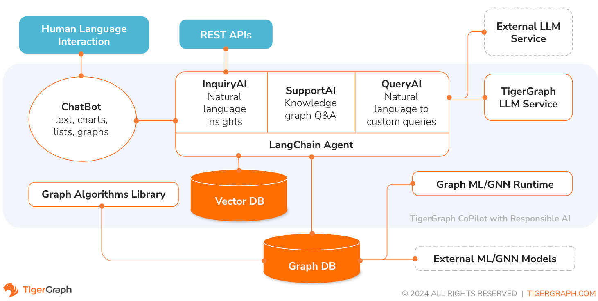

# TigerGraph CoPilot

## Releases
* **4/30/2024: CoPilot is available now in Beta** (v0.5). A whole new function is added to CoPilot: Now you can create chatbots with graph-augmented AI on a your own documents. CoPilot builds a knowledge graph from source material and applies knowledge graph RAG (Retrieval Augmented Generation) to improve the contextual relevance and accuracy of answers to their natural-language questions. We would love to hear your feedback to keep improving it so that it could bring more value to you. It would be helpful if you could fill out this [short survey](https://forms.gle/c9jd4evjEPsVtR5p7) after you have played with CoPilot. Thank you for your interest and support!

* **3/18/2024: CoPilot is available now in Alpha** (v0.0.1). It uses a Large Language Model (LLM) to convert your question into a function call, which is then executed on the graph in TigerGraph. We would love to hear your feedback to keep improving it so that it could bring more value to you. If you are trying it out, it would be helpful if you could fill out this [sign up form](https://info.tigergraph.com/copilotalpha) so we can keep track of it (no spam, promised). And if you would just like to provide the feedback, please feel free to fill out this [short survey](https://forms.gle/c9jd4evjEPsVtR5p7). Thank you for your interest and support!

## Overview



TigerGraph CoPilot is an AI assistant that is meticulously designed to combine the powers of graph databases and generative AI to draw the most value from data and to enhance productivity across various business functions, including analytics, development, and administration tasks. It is one AI assistant with three core component services:
* InquiryAI as a natural language assistant for graph-powered solutions
* SupportAI as a knowledge Q&A assistant for documents and graphs
* QueryAI as a GSQL code generator including query and schema generation, data mapping, and more (Not available in Beta; coming soon)

You can interact with CoPilot through both a chat interface on TigerGraph Cloud and APIs. For beta, your own LLM services (from OpenAI, Azure, GCP and AWS Bedrock) are required to use CoPilot, but in future releases you can use TigerGraph’s LLM or your local LLM as well.

### InquiryAI


When a question is posed in natural language, CoPilot (InquiryAI) employs a novel three-phase interaction with both the TigerGraph database and a LLM of the user's choice, to obtain accurate and relevant responses.

The first phase aligns the question with the particular data available in the database. CoPilot uses the LLM to compare the question with the graph’s schema and replace entities in the question by graph elements. For example, if there is a vertex type of “BareMetalNode” and the user asks “How many servers are there?”, the question will be translated to “How many BareMetalNode vertices are there?”. In the second phase, CoPilot uses the LLM to compare the transformed question with a set of curated database queries and functions in order to select the best match. In the third phase, CoPilot executes the identified query and returns the result in natural language along with the reasoning behind the actions. 

Using pre-approved queries provides multiple benefits. First and foremost, it reduces the likelihood of hallucinations, because the meaning and behavior of each query has been validated.  Second, the system has the potential of predicting the execution resources needed to answer the question. 

### SupportAI


With SupportAI, CoPilot creates chatbots with graph-augmented AI on a user's own documents or text data. It builds a knowledge graph from source material and applies its unique variant of knowledge graph-based RAG (Retrieval Augmented Generation) to improve the contextual relevance and accuracy of answers to natural-language questions.

CoPilot will also identify concepts and build an ontology, to add semantics and reasoning to the knowledge graph, or users can provide their own concept ontology. Then, with this comprehensive knowledge graph, CoPilot performs hybrid retrievals, combining traditional vector search and graph traversals, to collect more relevant information and richer context to answer users’ knowledge questions.

Organizing the data as a knowledge graph allows a chatbot to access accurate, fact-based information quickly and efficiently, thereby reducing the reliance on generating responses from patterns learned during training, which can sometimes be incorrect or out of date.


### QueryAI
QueryAI is the third component of TigerGraph CoPilot. It is designed to be used as a developer tool to help generate graph queries in GSQL from an English language description. It can also be used to generate schema, data mapping, and even dashboards. This will enable developers to write GSQL queries more quickly and accurately, and will be especially useful for those who are new to GSQL. QueryAI is available in alpha Q4 2024.

## Getting Started

### TigerGraph Cloud
CoPilot is available as an add-on service to your workspace on TigerGraph Cloud. Please follow the [instructions here](https://docs.tigergraph.com/tg-copilot/current/getstarted/oncloud) to start on TigerGraph Cloud within minutes.

### Self-Managed
TigerGraph CoPilot is open-source and can be deployed to your own infrastructure. This repo only includes the backend service of CoPilot but you can still access all of its functions through the APIs. What is different from CoPilot on TigerGraph Cloud is the absence of the graphical user interface and the extra steps to set it up and maintenance.

If you don’t need to extend the source code of CoPilot, the quickest way is to deploy its docker image with the docker compose file in the repo. In order to take this route, you will need the following prerequisites.

#### Prerequisites
* Docker
* API key of your LLM provider. (An LLM provider refers to a company or organization that offers Large Language Models (LLMs) as a service. The API key verifies the identity of the requester, ensuring that the request is coming from a registered and authorized user or application.) Currently, CoPilot supports the following LLM providers: OpenAI, Azure OpenAI, GCP, AWS Bedrock.

#### Deploy with Docker Compose
* Step 1: Get docker-compose file 
  - Download the [docker-compose.yml](https://github.com/tigergraph/copilot/blob/main/docker-compose.yml) file directly , or
  - Clone the repo `git clone https://github.com/tigergraph/CoPilot`

  The docker compose file contains all dependencies for CoPilot including a TigerGraph database. If any service is not needed, please feel free to remove it from the file. Besides, CoPilot comes with a Swagger API documentation page when it is deployed. If you wish to disable it, you can set the PRODUCTION environment variable to true for the CoPilot service in the compose file.

* Step 2: Set up configurations
  
  In the same directory as the docker compose file is in, create and fill in the following configuration files: `touch configs/db_config.json configs/llm_config.json configs/milvus_config.json`. Details for each configure file is available below.
  - [LLM config](#llm-provider-configuration)
  - [Tigergraph config](#db-configuration)
  - [Milvus config](#milvus-configuration)

* Step 3 (Optional): Configure Logging
  
  `touch configs/log_config.json`. Details for the configure file is available at [Logging config](#logging-configuration).

* Step 4: Start all services

  Simply run `docker compose up -d` and wait for all the services to start.

#### Configurations

##### LLM provider configuration
In the `configs/llm_config.json` file, copy JSON config template from below for your LLM provider, and fill out the appropriate fields. Only one provider is needed.

* OpenAI
  
  In addition to the `OPENAI_API_KEY`, `llm_model` and `model_name` can be edited to match your specific configuration details.

    ```json
    {
        "model_name": "GPT-4",
        "embedding_service": {
            "embedding_model_service": "openai",
            "authentication_configuration": {
                "OPENAI_API_KEY": "YOUR_OPENAI_API_KEY_HERE"
            }
        },
        "completion_service": {
            "llm_service": "openai",
            "llm_model": "gpt-4-0613",
            "authentication_configuration": {
                "OPENAI_API_KEY": "YOUR_OPENAI_API_KEY_HERE"
            },
            "model_kwargs": {
                "temperature": 0
            },
            "prompt_path": "./app/prompts/openai_gpt4/"
        }
    }
    ```
* GCP

    Follow the GCP authentication information found here: https://cloud.google.com/docs/authentication/application-default-credentials#GAC and create a Service Account with VertexAI credentials. Then add the following to the docker run command:

    ```sh
    -v $(pwd)/configs/SERVICE_ACCOUNT_CREDS.json:/SERVICE_ACCOUNT_CREDS.json -e GOOGLE_APPLICATION_CREDENTIALS=/SERVICE_ACCOUNT_CREDS.json
    ```

    And your JSON config should follow as:

    ```json
    {
        "model_name": "GCP-text-bison",
        "embedding_service": {
            "embedding_model_service": "vertexai",
            "authentication_configuration": {}
        },
        "completion_service": {
            "llm_service": "vertexai",
            "llm_model": "text-bison",
            "model_kwargs": {
                "temperature": 0
            },
            "prompt_path": "./app/prompts/gcp_vertexai_palm/"
        }
    }
    ```

* Azure
    In addition to the `AZURE_OPENAI_ENDPOINT`, `AZURE_OPENAI_API_KEY`, and `azure_deployment`, `llm_model` and `model_name` can be edited to match your specific configuration details.
    ```json
    {
        "model_name": "GPT35Turbo",
        "embedding_service": {
            "embedding_model_service": "azure",
            "azure_deployment":"YOUR_EMBEDDING_DEPLOYMENT_HERE",
            "authentication_configuration": {
                "OPENAI_API_TYPE": "azure",
                "OPENAI_API_VERSION": "2022-12-01",
                "AZURE_OPENAI_ENDPOINT": "YOUR_AZURE_ENDPOINT_HERE",
                "AZURE_OPENAI_API_KEY": "YOUR_AZURE_API_KEY_HERE"
            }
        },
        "completion_service": {
            "llm_service": "azure",
            "azure_deployment": "YOUR_COMPLETION_DEPLOYMENT_HERE",
            "openai_api_version": "2023-07-01-preview",
            "llm_model": "gpt-35-turbo-instruct",
            "authentication_configuration": {
                "OPENAI_API_TYPE": "azure",
                "AZURE_OPENAI_ENDPOINT": "YOUR_AZURE_ENDPOINT_HERE",
                "AZURE_OPENAI_API_KEY": "YOUR_AZURE_API_KEY_HERE"
            },
            "model_kwargs": {
                "temperature": 0
            },
            "prompt_path": "./app/prompts/azure_open_ai_gpt35_turbo_instruct/"
        }
    }
    ```

* AWS Bedrock
  ```json
  {
      "model_name": "Claude-3-haiku",
      "embedding_service": {
          "embedding_model_service": "bedrock",
          "embedding_model":"amazon.titan-embed-text-v1",
          "authentication_configuration": {
              "AWS_ACCESS_KEY_ID": "ACCESS_KEY",
              "AWS_SECRET_ACCESS_KEY": "SECRET"
          }
      },
      "completion_service": {
          "llm_service": "bedrock",
          "llm_model": "anthropic.claude-3-haiku-20240307-v1:0",
          "authentication_configuration": {
              "AWS_ACCESS_KEY_ID": "ACCESS_KEY",
              "AWS_SECRET_ACCESS_KEY": "SECRET"
          },
          "model_kwargs": {
              "temperature": 0,
          },
          "prompt_path": "./app/prompts/aws_bedrock_claude3haiku/"
      }
  }
  ```
##### DB configuration
Copy the below into `configs/db_config.json` and edit the `hostname` and `getToken` fields to match your database's configuration. Set the timeout, memory threshold, and thread limit parameters as desired to control how much of the database's resources are consumed when answering a question.

If you are running TigerGraph outside of docker compose, change the hostname to match its address (`http://localhost`, `https://your-TgCloud-hostname`). Once authentication is enabled in TigerGraph, set getToken to `true`.

You can also disable the consistency_checker, which reconciles Milvus and TigerGraph data, within this config.  It is true by default
```json
{
    "hostname": "http://tigergraph",
    "getToken": false,
    "default_timeout": 300,
    "default_mem_threshold": 5000,
    "default_thread_limit": 8,
    "enable_consistency_checker": true
}
```

##### Milvus configuration
Copy the below into `configs/milvus_config.json` and edit the `host` and `port` fields to match your Milvus configuration (keeping in mind docker configuration).  `username` and `password` can also be configured below if required by your Milvus setup.  `enabled` should always be set to "true" for now as Milvus is only the embedding store supported.
```json
{
    "host": "milvus-standalone",
    "port": 19530,
    "username": "",
    "password": "",
    "enabled": "true"
}
```

##### Logging configuration 

Copy the below into `configs/log_config.json` and edit the appropriate values to suit your needs.  The log rotation is based on size and backups are kept.  These configurations are applied in the LogWriter to the standard python logging package.  Operational and audit logs are recorded.  Outputs include log.ERROR, log.INFO, and log.AUDIT-COPILOT
```json
{
    "log_file_path": "logs",
    "log_max_size": 10485760,
    "log_backup_count": 10
}
```

To configure the logging level of the service, edit the CoPilot service's `LOGLEVEL` env variable in the docker-compose file. By default, the logging level is set to `"INFO"`.

This line can be changed to support different logging levels. The levels are described below:

* **CRITICAL**: A serious error
* **ERROR**: Failing to perform functions
* **WARNING**: Indication of unexpected problems, e.g. failure to map a user's question to the graph schema
* **INFO**: Confriming that the service is performing as expected.
* **DEBUG**: Detailed information, e.g. the functions retrieved during the GenerateFunction step, etc.
* **DEBUG_PII**: Finer-grained information that could potentially include PII, such as a user's question, the complete function call (with parameters), and the LLM's natural language response.
* **NOTSET**: All messages are processed

## Using TigerGraph CoPilot

### TigerGraph Cloud
A chat interface is available on TigerGraph Cloud, with which you can “talk” to your graph to get more insights and value from your data. Please follow the [instructions here](https://docs.tigergraph.com/tg-copilot/current/using-copilot/how2-use-on-cloud) to access CoPilot on TigerGraph Cloud.

### Using API
You can also access CoPilot via its API for both self-managed and TigerGraph Cloud-managed services. Two types of API access are provided for now: REST http endpoints and pyTigerGraph interface. Additionally, there is a primitive chatbot interface for testing purpose only. And LangChain interface is available for InquiryAI with more integrations coming soon. 

#### Authentication
When accessing its API, ​​there are two options to authenticate with the TigerGraph CoPilot service. 

First way is with a username/password pair generated from the TigerGraph database.

The second way is a GSQL secret, also obtained from the database. However, when using the GSQL secret, the username field must be specified as __GSQL__secret, with the password field containing the secret. Note: If pyTigerGraph is being used and a connection is created with the gsqlSecret parameter, this will already be done for you.

#### HTTP Endpoints
For self-managed services, the full list of available HTTP endpoints can be found at the /docs path on your host’s address, e.g., `http://localhost/docs`. It is a Swagger API doc and you can even try out the endpoints on that page. Note: The Swagger API doc page is disabled on TigerGraph Cloud.


#### Using pyTigerGraph
First, update pyTigerGraph to utilize the latest build:
```sh
pip install -U git+https://github.com/tigergraph/pyTigerGraph.git
```

Then, the endpoints are availble when configured with a `TigerGraphConnection`:

```py
from pyTigerGraph import TigerGraphConnection

# create a connection to the database
conn = TigerGraphConnection(host="DATABASE_HOST_HERE", graphname="GRAPH_NAME_HERE", username="USERNAME_HERE", password="PASSWORD_HERE")

### ==== CONFIGURE INQUIRYAI HOST ====
conn.ai.configureInquiryAIHost("INQUIRYAI_HOST_HERE")

### ==== RETRIEVE TOP-K DOCS FROM LIBRARY ====
# `top_k` parameter optional
conn.ai.retrieveDocs("How many papers are there?", top_k = 5)

### ==== RUN A NATURAL LANGUAGE QUERY ====
print(conn.ai.query("How many papers are there?"))

# prints: {'natural_language_response': 'There are 736389 papers.', 'answered_question': True, 'query_sources': {'function_call': "getVertexCount('Paper')", 'result': 736389}}

### ==== REGISTER A CUSTOM QUERY ====
# Prompt for PageRank query - could be read in as JSON file.
pr_prompt = {
    "function_header": "tg_pagerank",
    "description": "Determines the importance or influence of each vertex based on its connections to other vertices.",
    "docstring": "The PageRank algorithm measures the influence of each vertex on every other vertex. PageRank influence is defined recursively: a vertex’s influence is based on the influence of the vertices which refer to it. A vertex’s influence tends to increase if either of these conditions are met:\n* It has more referring vertices\n* Its referring vertices have higher influence\nTo run this algorithm, use `runInstalledQuery('tg_pagerank', params={'v_type': 'INSERT_V_TYPE_HERE', 'e_type': 'INSERT_E_TYPE_HERE', 'top_k': INSERT_TOP_K_HERE})`, where the parameters are:\n* 'v_type': The vertex type to run the algorithm on.\n* 'e_type': The edge type to run the algorithm on.\n* 'top_k': The number of top scoring vertices to return to the user.",
    "param_types": {
        "v_type": "str",
        "e_type": "str",
        "top_k": "int"
    }
}

# Register Query
conn.ai.registerCustomQuery(pr_prompt["function_header"], pr_prompt["description"], pr_prompt["docstring"], pr_prompt["param_types"])

# Run Query
print(conn.ai.query("What are the 5 most influential papers by citations?"))

# prints: {'natural_language_response': 'The top 5 most cited papers are:\n\n1. [Title of paper with Vertex_ID 428523]\n2. [Title of paper with Vertex_ID 384889]\n3. [Title of paper with Vertex_ID 377502]\n4. [Title of paper with Vertex_ID 61855]\n5. [Title of paper with Vertex_ID 416200]', 'answered_question': True, 'query_sources': {'function_call': "runInstalledQuery('tg_pagerank', params={'v_type': 'Paper', 'e_type': 'CITES', 'top_k': 5})", 'result': [{'@@top_scores_heap': [{'Vertex_ID': '428523', 'score': 392.8731}, {'Vertex_ID': '384889', 'score': 251.8021}, {'Vertex_ID': '377502', 'score': 149.1018}, {'Vertex_ID': '61855', 'score': 129.7406}, {'Vertex_ID': '416200', 'score': 129.2286}]}]}}
```

#### Chat with CoPilot
Navigate to `http://localhost/graphname/chat` when the Docker container is running, where graphname is the name of the graph you want to query. Note: This chat interface is for testing only. Please use CoPilot on TigerGraph Cloud for a proper chat interface.


#### Using LangChain
To use LangChain with InquiryAI, first install the LangChain fork here in your Python environment:
```
pip install git+https://github.com/langchain-ai/langchain.git
```
Then, you can get answers from the graph with the below:

```py
import pyTigerGraph as tg
conn = tg.TigerGraphConnection(host="DATABASE_HOST_HERE", graphname="GRAPH_NAME_HERE", username="USERNAME_HERE", password="PASSWORD_HERE")

### ==== CONFIGURE INQUIRYAI HOST ====
conn.ai.configureInquiryAIHost("INQUIRYAI_HOST_HERE")

from langchain_community.graphs import TigerGraph
graph = TigerGraph(conn)
result = graph.query("How many servers are there?")
print(result)
# {'natural_language_response': 'There are 46148 servers.', 
#  'answered_question': True,
#  'query_sources': {'function_call': 'getVertexCount(vertexType="BareMetalNode")', 
#                    'result': 46148}
```

## Customization and Extensibility
TigerGraph CoPilot is designed to be easily extensible. The service can be configured to use different LLM providers, different graph schemas, and different LangChain tools. The service can also be extended to use different embedding services, different LLM generation services, and different LangChain tools. For more information on how to extend the service, see the [Developer Guide](./docs/DeveloperGuide.md).

## Testing
A family of tests are included under the `tests` directory. If you would like to add more tests please refer to the [guide here](./docs/DeveloperGuide.md#adding-a-new-test-suite). A shell script `run_tests.sh` is also included in the folder which is the driver for running the tests. The easiest way to use this script is to execute it in the Docker Container for testing.

### Test in Docker Container

First, make sure that all your LLM service provider configuration files are working properly. The configs will be mounted for the container to access. Also make sure that all the dependencies such as database and Milvus are ready. If not, you can run the included docker compose file to create those services.
```sh
docker compose docker-compose.yml up -d --build
```

If you want to use Weights And Biases for logging the test results, your WandB API key needs to be set in an environment variable on the host machine.

```sh
export WANDB_API_KEY=KEY HERE
```

Then, you can build the docker container from the `Dockerfile.tests` file and run the test script in the container.
```sh
docker build -f Dockerfile.tests -t copilot-tests:0.1 .

docker run -d -v $(pwd)/configs/:/ -e GOOGLE_APPLICATION_CREDENTIALS=/GOOGLE_SERVICE_ACCOUNT_CREDS.json -e WANDB_API_KEY=$WANDB_API_KEY -it --name copilot-tests copilot-tests:0.1


docker exec copilot-tests bash -c "conda run --no-capture-output -n py39 ./run_tests.sh all all"
```

### Test Script Options

To edit what tests are executed, one can pass arguments to the `./run_tests.sh` script. Currently, one can configure what LLM service to use (defaults to all), what schemas to test against (defaults to all), and whether or not to use Weights and Biases for logging (defaults to true). Instructions of the options are found below:

#### Configure LLM Service
The first parameter to `run_tests.sh` is what LLMs to test against. Defaults to `all`. The options are:

* `all` - run tests against all LLMs
* `azure_gpt35` - run tests against GPT-3.5 hosted on Azure
* `openai_gpt35` - run tests against GPT-3.5 hosted on OpenAI
* `openai_gpt4` - run tests on GPT-4 hosted on OpenAI
* `gcp_textbison` - run tests on text-bison hosted on GCP

#### Configure Testing Graphs
The second parameter to `run_tests.sh` is what graphs to test against. Defaults to `all`. The options are:

* `all` - run tests against all available graphs
* `OGB_MAG` - The academic paper dataset provided by: https://ogb.stanford.edu/docs/nodeprop/#ogbn-mag.
* `DigtialInfra` - Digital infrastructure digital twin dataset
* `Synthea` - Synthetic health dataset

#### Configure Weights and Biases
If you wish to log the test results to Weights and Biases (and have the correct credentials setup above), the final parameter to `run_tests.sh` automatically defaults to true. If you wish to disable Weights and Biases logging, use `false`.


## Contributing
If you would like to contribute to TigerGraph CoPilot, please read the documentation [here](./docs/Contributing.md).
